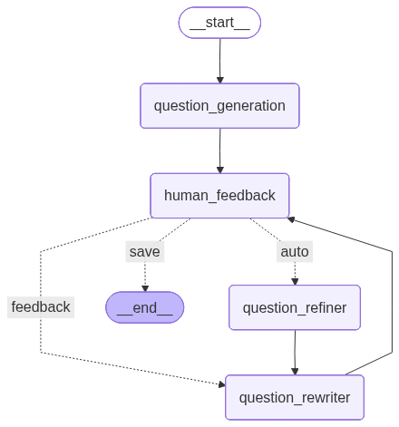
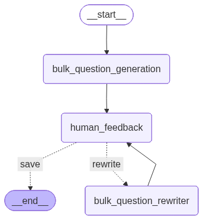
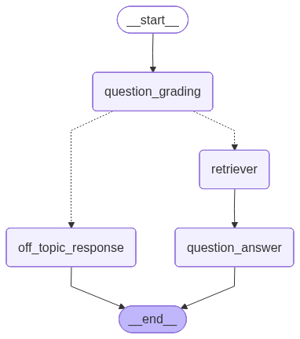
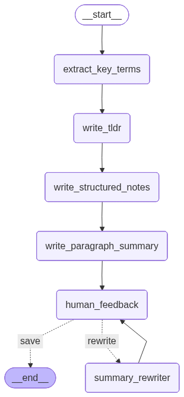

# 🧠 StudyAI — AI-Powered Academic Study Assistant

<p align="center">
  
  
  
  
  
</p>

<p align="center">
  <strong>Upload any document. Generate questions. Take AI-built exams. Ask anything. Get instant summaries.</strong><br/>
  A full-stack, agentic study platform built on LangGraph state machines, FastAPI, and a beautiful Gradio UI.
</p>

---

## 📽️ Demo Videos


| Feature | Demo |
|---|---|
| 📄 Document Upload & Processing | [▶️ Watch](docs/videos/Document%20Upload%20%26%20Processing.mp4) |
| ✏️ Iterative Question Generation | [▶️ Watch](docs/videos/question_generation.mp4) |
| 📝 Exam Mode — Bulk Generation & Scoring | [▶️ Watch](docs/videos/ExamGeneration.mp4) |
| 🗨️ Document Question Answering (RAG) | [▶️ Watch](docs/videos/question_answering.mp4) |
| 📚 AI Summary Generator | [▶️ Watch](docs/videos/summarization.mp4) |
---

## ✨ Features at a Glance

| Module | What it does |
|---|---|
| **File Processing** | Ingests PDF, TXT, DOCX, and audio files; extracts clean text; stores in `assets/clean_files/` |
| **Question Generation** | LangGraph agent generates one question at a time, accepts human or automated feedback to refine it |
| **Exam Mode** | Generates a full exam (1–50 questions, MCQ / T/F / Mixed) with human-in-the-loop refinement, then scores answers |
| **Question Answering** | RAG pipeline — embeds document into ChromaDB, grades whether question is on-topic, retrieves relevant chunks, streams the answer |
| **Summarization** | Four-section summary pipeline (Key Terms → TL;DR → Structured Notes → Paragraph Summary) with feedback-driven rewriting |

---

## 🏗️ Architecture Overview

```
User (Gradio UI)
       │  HTTP / SSE
       ▼
  FastAPI Server  (main.py)
       │
       ├── /fileProcessing   ──► ProcessController  ──► TextStorageService
       ├── /start_session    ──► QG_Graph  (LangGraph)
       ├── /continue         ──► QG_Graph  (resume via interrupt)
       ├── /start_bulk_session ► BulkQG_Graph (LangGraph)
       ├── /bulk_continue    ──► BulkQG_Graph (resume)
       ├── /start_QA_session ──► ChromaDB  ──► QA_Graph (LangGraph)
       ├── /QA_continue      ──► QA_Graph  (resume)
       ├── /start_SG_session ──► SG_Graph  (LangGraph, SSE streaming)
       └── /SG_continue      ──► SG_Graph  (resume)
```

---

## 📄 File Processing Pipeline

When you click **Upload & Process**, the following steps execute:

```
1.  Validate file type & size
         │  (DataController.validate_file)
         ▼
2.  Generate a collision-safe filename
         │  (DataController.get_file_name → random_token + cleaned_name)
         ▼
3.  Write the raw file to disk  (async aiofiles)
         │  assets/uploaded_real_files/{project_id}/{token}_{filename}
         ▼
4.  Extract plain text  (ProcessController.extract_content)
         │
         ├── .txt  →  read with utf-8
         ├── .pdf  →  PyMuPDF (page-by-page) or Docling (complex layout + OCR)
         ├── .docx →  python-docx paragraph join or Docling
         └── .mp3/.wav/.m4a → ffmpeg → WAV → OpenAI Whisper transcription
         ▼
5.  Save clean text (async aiofiles)
         │  assets/clean_files/{project_id}/{filename}_clean.txt
         ▼
6.  Return { thread_id, uploaded_file, text_file } to the client
```

The `text_file` path is stored in Gradio state and passed to every downstream
model as `clean_text_file_path`. This means **all models share the same
pre-processed text** — no repeated parsing.

---

## 🤖 Model 1 — Iterative Question Generation

> **Route:** `POST /start_session` · `POST /continue`

### How it works

The QG model is a **human-in-the-loop LangGraph state machine**. It generates
one question per session and allows the user (or the AI itself) to iteratively
refine it before saving.

### State

```python
QuestionGenState = {
    context: str,          # full document text
    question_type: "MCQ" | "T/F",
    question: str,
    options: list[str] | None,
    answer: str,
    explanation: str,
    history: list,         # compressed conversation history
    feedback: str,
}
```

### Graph — Flow Diagram

> 


### Nodes

| Node | Role |
|---|---|
| `question_generation` | Calls the LLM with a few-shot prompt to produce a structured question |
| `human_feedback` | **Interrupts** the graph — waits for user input via `langgraph.types.interrupt` |
| `question_refiner` | AI self-critique: analyses the question and produces structured feedback |
| `question_rewriter` | Rewrites the question based on feedback; compresses history to avoid context overflow |

### Router logic

```
feedback == "save"  → END
feedback == "auto"  → question_refiner → question_rewriter → human_feedback
anything else       → question_rewriter → human_feedback
```

---

## 📝 Model 2 — Bulk Exam Generation

> **Route:** `POST /start_bulk_session` · `POST /bulk_continue`

### How it works

The Bulk QG model generates a **full set of N questions in one LLM call**,
then enters a human-in-the-loop loop that can regenerate the entire set
based on feedback.

### State

```python
BulkQuestionGenState = {
    context: str,
    question_type: "MCQ" | "T/F" | "Both",
    num_questions: int,
    questions: list[BulkQuestionItem],
    feedback: str,
    history: list,
}
```

### Graph — Flow Diagram

> 

### Complexity distribution

The generation prompt instructs the model to automatically distribute
difficulty: roughly ⅓ easy, ⅓ medium, ⅓ hard. The Gradio UI displays
coloured badges (🟢 / 🟡 / 🔴) and scores the exam with per-question
explanations.

---

## 🗨️ Model 3 — Retrieval-Augmented Question Answering

> **Route:** `POST /start_QA_session` · `POST /QA_continue`

### How it works

The QA model is a **RAG pipeline wrapped in a LangGraph graph**. On first
call it chunks the document, embeds it into ChromaDB, and streams the answer
token by token over SSE.

### State

```python
QuestionAnsweringState = {
    message: list[BaseMessage],        # current user message
    relevant_text: list[Document],     # retrieved chunks
    on_topic: str,                     # "Yes" | "No"
    context: str,                      # full document text (for grading)
    conversation_history: list[BaseMessage],
}
```

### Graph — Flow Diagram

> 


### Nodes

| Node | Role |
|---|---|
| `question_grading` | Few-shot LLM classifier decides if the question is on-topic; simultaneously builds the ChromaDB retriever and fetches top-5 MMR chunks |
| `retriever` | Pass-through node (retrieval already done in grading for efficiency) |
| `question_answer` | Generates the final answer conditioned on retrieved chunks + full conversation history |
| `off_topic_response` | Returns a fixed, polite rejection for off-topic questions |

### Embedding & Vector Store

- Chunks split with `RecursiveCharacterTextSplitter` (chunk=100, overlap=20)
- Embedded via the provider set in `.env` (`EMBEDDING_BACKEND` / `EMBEDDING_MODEL_ID`)
- Stored in ChromaDB at `assets/vector_dB/{VECTOR_DB_PATH}`
- Retrieved with **Maximum Marginal Relevance (MMR)** — top 5 results

---

## 📚 Model 4 — Study Summary Generator

> **Route:** `POST /start_SG_session` · `POST /SG_continue`

### How it works

The SG model is a **streaming, multi-stage LangGraph pipeline** that produces
four complementary study artefacts in sequence. Responses stream to the UI
token-by-token via Server-Sent Events.

### State

```python
SummaryGenState = {
    context: str,
    depth: "brief" | "standard" | "detailed",
    key_terms: str,           # JSON array of {term, definition}
    tldr: str,
    structured_notes: str,    # markdown with ## headings
    paragraph_summary: str,
    feedback: str,
    old_output: str,          # snapshot before rewrite
}
```

### Graph — Flow Diagram

> 


### Output sections

| Section | Format | Content |
|---|---|---|
| **Key Terms** | JSON array | 5–20 `{term, definition}` objects; count scales with depth |
| **TL;DR** | Plain prose | 2–5 sentences; most important idea first |
| **Structured Notes** | Markdown (##/###/bullets) | Scannable revision notes with **Key Takeaways** at end |
| **Paragraph Summary** | Flowing prose | Connected study guide paragraphs with transitions |

### Depth levels

| Depth | Key Terms | TL;DR | Notes sections | Summary paragraphs |
|---|---|---|---|---|
| `brief` | 5 | 2–3 sentences | 3–5 sections, 2–3 bullets | 1–2 paragraphs |
| `standard` | ~12 | 3–4 sentences | 4–7 sections, 3–5 bullets | 3–4 paragraphs |
| `detailed` | 20 | 4–5 sentences | 6–10 sections, 5–8 bullets | 5–8 paragraphs |

---

## 🚀 Quick Start

### 1. Clone & set up environment

```bash
git clone https://github.com/your-org/studyai.git
cd studyai

conda create -n studyai python=3.10
conda activate studyai
conda install pip
pip install -r requirements.txt
```

### 2. Configure environment variables

```bash
cp .env.example .env
# Edit .env with your API keys and settings
```

Key variables:

```env
APP_NAME=StudyAI
APP_VERSION=1.0.0

FILE_ALLOWED_TYPES=["application/pdf","text/plain","application/vnd.openxmlformats-officedocument.wordprocessingml.document","audio/mpeg","audio/wav"]
FILE_MAX_SIZE=20          # MB
FILE_DEFAULT_CHUNK_SIZE=500

GENERATION_BACKEND=OPENAI          # OPENAI | GROQ | GOOGLE_GENAI | OLLAMA
GENERATION_MODEL_ID=gpt-4o-mini
GENERATION_DAFAULT_TEMPERATURE=0.2
GENERATION_DAFAULT_MAX_TOKENS=2048

EMBEDDING_BACKEND=HUGGINGFACE
EMBEDDING_MODEL_ID=sentence-transformers/all-MiniLM-L6-v2
EMBEDDING_MODEL_SIZE=384

VECTOR_DB_BACKEND=CHROMA
VECTOR_DB_PATH=chroma_store
VECTOR_DB_DISTANCE_METHOD=cosine

OPENAI_API_KEY=sk-...
# GROQ_API_KEY=gsk_...
# GEMINI_API_KEY=...

MONGODB_URL=mongodb://localhost:27017
MONGODB_DATABASE=studyai

LANGCHAIN_API_KEY=...
LANGCHAIN_TRACING_V2=true
LANGCHAIN_ENDPOINT=https://api.smith.langchain.com
LANGCHAIN_PROJECT=studyai
```

### 3. Start the FastAPI backend

```bash
uvicorn main:app --reload --host 0.0.0.0 --port 5000
```

### 4. Start the Gradio UI

```bash
python gradio_ui.py
# Opens at http://localhost:7860
```

---

## 🗂️ Project Structure

```
studyai/
├── main.py                          # FastAPI app entry point
├── gradio_ui.py                     # Gradio frontend
├── requirements.txt
│
├── routes/
│   ├── data.py                      # File upload & processing endpoint
│   ├── QG.py                        # Question generation routes
│   ├── TG.py                        # Bulk / exam generation routes
│   ├── QA.py                        # Question answering routes
│   └── SG.py                        # Summarization routes
│
├── models/
│   ├── QuestionGeneration/          # QG LangGraph agent
│   │   ├── QGGraphs/QGgraph.py
│   │   ├── QGPrompts/               # Generation, refiner, rewriter prompts
│   │   ├── QGStates/
│   │   └── QGSchemaes/
│   │
│   ├── ExamsGeneration/             # Bulk QG LangGraph agent
│   │   ├── BulkGraph.py
│   │   └── schema.py
│   │
│   ├── QuestionAnswering/           # RAG QA LangGraph agent
│   │   ├── QAGraphs/QAgraph.py
│   │   ├── QAPrompts/
│   │   ├── QAStates/
│   │   └── QASchemaes/
│   │
│   └── SummarizationGeneration/     # Summary LangGraph agent
│       ├── SGGraphs/SGgraph.py
│       ├── SGPrompts/detailsPrompts.py
│       └── SGStates/
│
├── controllers/
│   ├── BaseController.py
│   ├── DataController.py            # File validation & naming
│   ├── ProcessController.py         # Text extraction (PDF/DOCX/audio)
│   ├── ProjectController.py         # Project folder management
│   ├── StorageController.py         # Async text read/write
│   └── doclingParser.py             # Docling complex-document converter
│
├── stores/llm/
│   ├── LLMProviderFactory.py        # Unified LLM provider (OpenAI/Groq/Gemini/Ollama)
│   ├── EmbeddingProviderFactory.py  # Embedding provider
│   └── providers/
│
├── helpers/
│   ├── Config.py                    # Pydantic settings
│   └── graphVisualization.py        # Export graph PNGs
│
├── constants/
│   └── enums/
│
└── assets/
    ├── uploaded_real_files/         # Raw uploaded files (by project)
    ├── clean_files/                 # Extracted clean text (by project)
    └── vector_dB/                   # ChromaDB persistent storage
```

---

## 🔌 Supported LLM Providers

| Provider | Backend value | Notes |
|---|---|---|
| OpenAI / GitHub Models | `OPENAI` | GPT-4o, GPT-4o-mini, etc. |
| Google Gemini | `GOOGLE_GENAI` | gemini-1.5-pro, gemini-flash |
| Groq | `GROQ` | llama3, mixtral — very fast |
| Ollama (local) | `OLLAMA` | Any locally running model |

---

## 🔌 Supported Embedding Providers

| Provider | Backend value |
|---|---|
| HuggingFace Sentence Transformers | `HUGGINGFACE` |
| OpenAI Embeddings | `OPENAI` |
| Local SentenceTransformer | `LOCAL_EMBEDDING` |

---

## 📦 Key Dependencies

| Package | Purpose |
|---|---|
| `langgraph` | State machine graphs with human-in-the-loop interrupts |
| `langchain-core` | Prompts, messages, runnables |
| `langchain-community` | ChromaDB vector store integration |
| `fastapi` + `uvicorn` | Async REST API + SSE streaming |
| `gradio` | Interactive web UI |
| `chromadb` | Local vector database |
| `pymupdf` | PDF text extraction |
| `python-docx` | DOCX text extraction |
| `openai-whisper` | Audio transcription |
| `docling` | Complex PDF / DOCX with OCR |
| `sentence-transformers` | Local text embeddings |
| `aiofiles` | Non-blocking file I/O |
| `pydantic-settings` | Type-safe configuration |

---

## 🤝 Contributing

1. Fork the repository
2. Create a feature branch: `git checkout -b feature/your-feature`
3. Commit your changes: `git commit -m 'feat: add your feature'`
4. Push to the branch: `git push origin feature/your-feature`
5. Open a Pull Request

---


<p align="center">
  Built with ❤️ using <strong>LangGraph · FastAPI · Gradio · ChromaDB</strong>
</p>